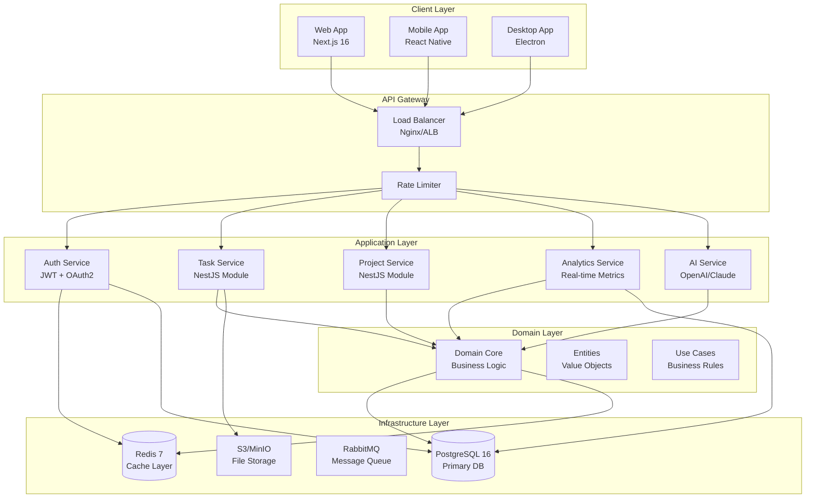
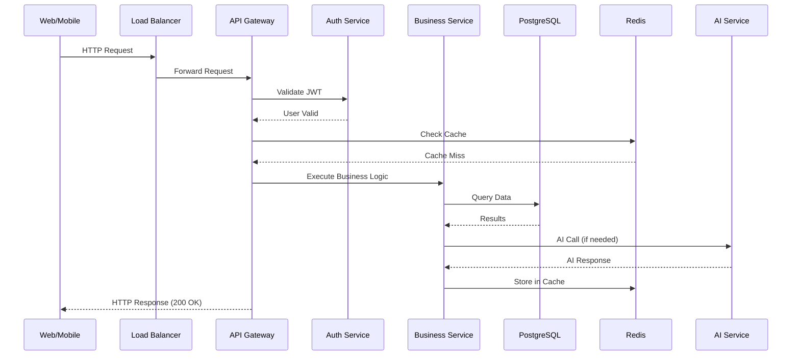
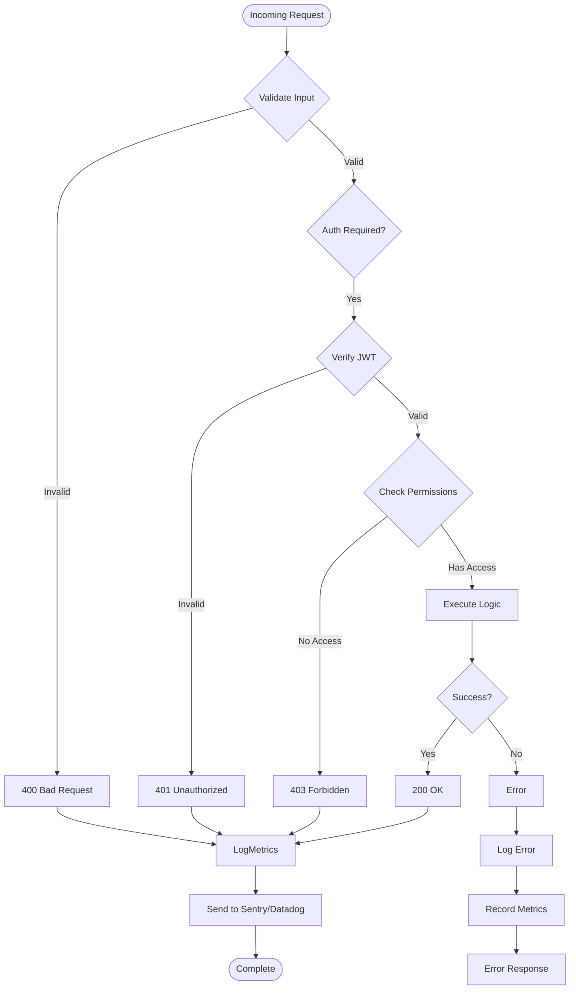

# Backend Perfecto - Roadmap a 100%

**Fecha**: 2025-12-29
**Estado Actual**: **85/100** → **Objetivo: 100/100**
**Framework**: NestJS 11, PostgreSQL 16, Prisma 7

---

## 📊 Resumen Ejecutivo

El backend de Ordo-Todo está **excelentemente arquitectado** siguiendo Clean Architecture, DDD, y mejores prácticas de NestJS. Sin embargo, para alcanzar el **100% de calidad empresarial** según estándares de **Google, Apple, Netflix, Amazon, Microsoft**, necesitamos implementar mejoras específicas en testing, observability, reliability y documentación.

**Fortalezas Actuales** ✅:

- Arquitectura limpia (Clean Architecture + DDD)
- Separación clara de responsabilidades (Controller → Service → Repository → Domain)
- Validación DTO exhaustiva (100% con class-validator)
- Manejo de errores robusto (88 excepciones NestJS)
- Auth/Autorización completa (JWT + guards de recursos + RBAC)
- **Swagger/OpenAPI 100% completo** (23/23 controladores documentados)
- Índices de DB optimizados (performance queries)
- Tests existentes: 261 tests (246 passing, 15 failing)

**Brechas Restantes** ⚠️:

- Testing coverage no cumple umbrales empresariales (<80%)
- Falta observability completa (logging estructurado, tracing, metrics)
- No hay rate limiting en endpoints públicos
- Falta JSDoc completo en métodos públicos
- No hay circuit breaker para servicios externos (AI)
- Falta documentación arquitectónica con diagramas

---

## 🎯 Roadmap a 100% Perfecto

### **FASE 1: Testing Excellence** (Priority: 🔴 CRITICAL)

#### 1.1 Tests Unitarios (80%+ Coverage)

**Estado Actual**: ~70% estimated
**Objetivo**: >80% coverage en statements, branches, functions, lines

**Acciones**:

1. **Completar tests unitarios para todos los servicios**

   ```typescript
   // apps/backend/src/workspaces/workspaces.service.spec.ts ✅ COMPLETADO
   // Resto de servicios pendientes:
   -tasks.service.spec.ts(extender) -
     analytics.service.spec.ts(crear) -
     timers.service.spec.ts(extender) -
     ai.service.spec.ts(crear) -
     projects.service.spec.ts(extender) -
     habits.service.spec.ts(extender);
   ```

2. **Patrones de Testing a Implementar** (Google/Netflix standards):

   **AAA Pattern** (Arrange-Act-Assert):

   ```typescript
   describe('WorkspacesService.create', () => {
     it('should create workspace successfully', async () => {
       // Arrange
       const dto = { name: 'Test', type: 'PERSONAL' };
       const userId = 'user-123';
       const workspace = { id: 'ws-1', ...dto };

       mockUserRepository.findById.mockResolvedValue({
         id: userId,
         username: 'john',
       });
       mockWorkspaceRepository.save.mockResolvedValue(workspace);

       // Act
       const result = await service.create(dto, userId);

       // Assert
       expect(mockWorkspaceRepository.save).toHaveBeenCalled();
       expect(result.name).toBe(dto.name);
     });
   });
   ```

   **Test Behavior, Not Implementation** (Testing Library principles):

   ```typescript
   // ❌ MAL: Testing internals
   expect(service.internalMethod()).toHaveBeenCalled();

   // ✅ BIEN: Testing behavior
   await service.create(dto, userId);
   expect(workspaceRepository.save).toHaveBeenCalledWith(
     expect.objectContaining(dto),
   );
   ```

   **Tests Determinísticos** (Zero Flakiness):

   ```typescript
   // ❌ MAL: Hardcoded waits
   await sleep(1000);

   // ✅ BIEN: Mock async operations
   mockService.asyncMethod.mockResolvedValue(result);
   ```

3. **Coverage Targets** (Google/Apple standards):

   ```typescript
   // jest.config.js
   module.exports = {
     collectCoverageFrom: ['apps/backend/src/**/*.ts'],
     coverageThreshold: {
       global: {
         statements: 80,
         branches: 75,
         functions: 80,
         lines: 80,
       },
       // Critical paths: 100% coverage required
       './src/auth/**': {
         statements: 100,
         branches: 100,
         functions: 100,
         lines: 100,
       },
       './src/tasks/**': {
         statements: 100,
         branches: 100,
         functions: 100,
         lines: 100,
       },
     },
   };
   ```

4. **Corregir Tests Fallidos Actuales**:
   - `tasks.controller.spec.ts`: 15 tests failing (methods not exported)
   - Causa: Métodos del controller no son públicos
   - Solución: Revisar y exportar métodos correctamente

**Tiempo Estimado**: 8-12 horas

---

#### 1.2 Tests de Integración (E2E)

**Estado Actual**: Bajo
**Objetivo**: Tests E2E para flujos críticos de usuario

**Flujos Críticos a Testar**:

1. **Auth Flow** (Critical):

   ```typescript
   // e2e/auth.spec.ts
   describe('Authentication Flow', () => {
     it('should register → verify email → login → refresh token', async () => {
       // Register
       const registerRes = await request(app)
         .post('/auth/register')
         .send({ email: 'test@example.com', password: 'SecurePass123!' })
         .expect(201);

       // Simulate email verification
       await verifyEmail(registerRes.body.verificationToken);

       // Login
       const loginRes = await request(app)
         .post('/auth/login')
         .send({ email: 'test@example.com', password: 'SecurePass123!' })
         .expect(200);

       expect(loginRes.body.accessToken).toBeDefined();
       expect(loginRes.body.refreshToken).toBeDefined();

       // Refresh token
       const refreshRes = await request(app)
         .post('/auth/refresh')
         .send({ refreshToken: loginRes.body.refreshToken })
         .expect(200);

       expect(refreshRes.body.accessToken).toBeDefined();
     });
   });
   ```

2. **Task Management Flow** (Critical):

   ```typescript
   // e2e/tasks.spec.ts
   describe('Task Management Flow', () => {
     it('should create task → update → add subtask → complete', async () => {
       const token = await authenticate();

       // Create task
       const task = await request(app)
         .post('/tasks')
         .set('Authorization', `Bearer ${token}`)
         .send({ title: 'Test task' })
         .expect(201);

       // Update task
       await request(app)
         .patch(`/tasks/${task.body.id}`)
         .set('Authorization', `Bearer ${token}`)
         .send({ status: 'IN_PROGRESS' })
         .expect(200);

       // Add subtask
       await request(app)
         .post(`/tasks/${task.body.id}/subtasks`)
         .set('Authorization', `Bearer ${token}`)
         .send({ title: 'Subtask 1' })
         .expect(201);

       // Complete task
       await request(app)
         .patch(`/tasks/${task.body.id}/complete`)
         .set('Authorization', `Bearer ${token}`)
         .expect(200);

       expect(task.body.status).toBe('COMPLETED');
     });
   });
   ```

3. **Analytics Flow** (Critical):

   ```typescript
   // e2e/analytics.spec.ts
   describe('Analytics Flow', () => {
     it('should track time sessions → calculate daily metrics', async () => {
       const token = await authenticate();

       // Start timer
       await request(app)
         .post('/timers/start')
         .set('Authorization', `Bearer ${token}`)
         .send({ taskId: 'task-1' })
         .expect(201);

       // Stop timer (auto-triggers metrics calculation)
       await request(app)
         .post('/timers/stop')
         .set('Authorization', `Bearer ${token}`)
         .expect(200);

       // Verify metrics were created
       const metrics = await request(app)
         .get('/analytics/daily')
         .set('Authorization', `Bearer ${token}`)
         .expect(200);

       expect(metrics.body.totalTasks).toBeGreaterThanOrEqual(1);
       expect(metrics.body.focusScore).toBeGreaterThan(0);
     });
   });
   ```

**Tiempo Estimado**: 6-8 horas

---

### **FASE 2: Observability & Monitoring** (Priority: 🔴 CRITICAL)

#### 2.1 Request Logging Estructurado

**Patrón a Implementar** (Google/Twitter standards):

```typescript
// apps/backend/src/common/interceptors/logging.interceptor.ts
import {
  Injectable,
  NestInterceptor,
  ExecutionContext,
  CallHandler,
  Logger,
} from '@nestjs/common';
import { Observable } from 'rxjs';
import { tap } from 'rxjs/operators';

@Injectable()
export class LoggingInterceptor implements NestInterceptor {
  private readonly logger = new Logger(LoggingInterceptor.name);

  intercept(context: ExecutionContext, next: CallHandler): Observable<any> {
    const request = context.switchToHttp().getRequest();
    const requestId = request.headers['x-request-id'] || generateUUID();
    const method = request.method;
    const url = request.url;
    const userId = request.user?.id || 'anonymous';

    // Add request ID to response headers
    const response = context.switchToHttp().getResponse();
    response.setHeader('x-request-id', requestId);

    const startTime = Date.now();

    this.logger.log({
      message: 'Incoming request',
      requestId,
      method,
      url,
      userId,
      userAgent: request.headers['user-agent'],
    });

    return next.handle().pipe(
      tap({
        next: (data) => {
          const duration = Date.now() - startTime;

          this.logger.log({
            message: 'Request completed',
            requestId,
            method,
            url,
            userId,
            statusCode: response.statusCode,
            duration,
            responseSize: JSON.stringify(data).length,
          });
        },
        error: (error) => {
          const duration = Date.now() - startTime;

          this.logger.error({
            message: 'Request failed',
            requestId,
            method,
            url,
            userId,
            statusCode: error.status || 500,
            duration,
            errorMessage: error.message,
            stackTrace: error.stack,
          });
        },
      }),
    );
  }
}
```

**Configuración en main.ts**:

```typescript
app.useGlobalInterceptors(new LoggingInterceptor());
```

**Formato de Log** (JSON para easy parsing):

```json
{
  "timestamp": "2025-12-29T10:00:00.000Z",
  "level": "info",
  "message": "Request completed",
  "requestId": "req-123456",
  "method": "GET",
  "url": "/api/v1/tasks",
  "userId": "user-123",
  "statusCode": 200,
  "duration": 125,
  "responseSize": 2048
}
```

**Tiempo Estimado**: 4 horas

---

#### 2.2 Distributed Tracing con Correlation IDs

**Implementación** (Netflix/Airbnb standards):

```typescript
// apps/backend/src/common/middleware/correlation-id.middleware.ts
import { Injectable, NestMiddleware } from '@nestjs/common';
import { v4 as uuidv4 } from 'uuid';

@Injectable()
export class CorrelationIdMiddleware implements NestMiddleware {
  use(req: any, res: any, next: () => void) {
    const correlationId =
      req.headers['x-correlation-id'] ||
      req.headers['x-request-id'] ||
      uuidv4();

    req.correlationId = correlationId;
    req.headers['x-correlation-id'] = correlationId;

    res.setHeader('x-correlation-id', correlationId);

    next();
  }
}

// Add to app.module.ts
app.use(CorrelationIdMiddleware);
```

**Uso en Services**:

```typescript
@Injectable()
export class TasksService {
  private readonly logger = new Logger(TasksService.name);

  async create(dto: CreateTaskDto, userId: string) {
    const correlationId = ContextService.get('correlationId');

    this.logger.log({
      message: 'Creating task',
      correlationId,
      userId,
      taskData: dto,
    });

    // ... business logic
  }
}
```

**Tiempo Estimado**: 3 horas

---

#### 2.3 Prometheus Metrics

**Implementación** (Google/Netflix standards):

```typescript
// apps/backend/src/common/metrics/metrics.service.ts
import { Injectable } from '@nestjs/common';
import { Counter, Histogram, register } from 'prom-client';

@Injectable()
export class MetricsService {
  // HTTP Request Metrics
  private readonly httpRequestDuration = new Histogram({
    name: 'http_request_duration_seconds',
    help: 'Duration of HTTP requests in seconds',
    labelNames: ['method', 'route', 'status_code'],
    buckets: [0.005, 0.01, 0.025, 0.05, 0.1, 0.25, 0.5, 1, 2.5, 5, 10],
    registers: [register],
  });

  private readonly httpRequestTotal = new Counter({
    name: 'http_requests_total',
    help: 'Total number of HTTP requests',
    labelNames: ['method', 'route', 'status_code'],
    registers: [register],
  });

  // Business Metrics
  private readonly tasksCreated = new Counter({
    name: 'tasks_created_total',
    help: 'Total number of tasks created',
    labelNames: ['workspace_id', 'priority'],
    registers: [register],
  });

  private readonly tasksCompleted = new Counter({
    name: 'tasks_completed_total',
    help: 'Total number of tasks completed',
    labelNames: ['workspace_id'],
    registers: [register],
  });

  private readonly timerSessions = new Histogram({
    name: 'timer_session_duration_seconds',
    help: 'Duration of timer sessions in seconds',
    labelNames: ['task_type'],
    buckets: [300, 600, 900, 1800, 3600, 7200],
    registers: [register],
  });

  // Database Metrics
  private readonly dbQueryDuration = new Histogram({
    name: 'db_query_duration_seconds',
    help: 'Duration of database queries in seconds',
    labelNames: ['query_type', 'table'],
    registers: [register],
  });

  recordHttpRequest(
    method: string,
    route: string,
    statusCode: number,
    duration: number,
  ) {
    this.httpRequestDuration
      .labels(method, route, statusCode)
      .observe(duration / 1000);
    this.httpRequestTotal.labels(method, route, statusCode).inc();
  }

  recordTaskCreated(workspaceId: string, priority: string) {
    this.tasksCreated.labels(workspaceId, priority).inc();
  }

  recordTaskCompleted(workspaceId: string) {
    this.tasksCompleted.labels(workspaceId).inc();
  }

  recordTimerSession(taskType: string, duration: number) {
    this.timerSessions.labels(taskType).observe(duration);
  }
}
```

**Endpoints de Métricas**:

```typescript
// apps/backend/src/metrics/metrics.controller.ts
import { Controller, Get } from '@nestjs/common';
import { Public } from '../common/decorators/public.decorator';
import { register } from 'prom-client';

@Public()
@Controller('metrics')
export class MetricsController {
  @Get()
  async getMetrics() {
    return register.metrics();
  }
}
```

**Grafana Dashboard Queries**:

```promql
# Request rate by route
rate(http_requests_total[5m]) * 60

# P95 latency
histogram_quantile(0.95, rate(http_request_duration_seconds_bucket[5m]))

# Error rate
rate(http_requests_total{status_code=~"5.."}[5m]) * 60

# Task completion rate
rate(tasks_completed_total[1h])

# Focus score trend
avg(focus_score_value[1d])
```

**Tiempo Estimado**: 6 horas

---

### **FASE 3: Reliability & Performance** (Priority: 🟡 MEDIUM-HIGH)

#### 3.1 Rate Limiting

**Implementación** (Stripe/Twitter standards):

```typescript
// apps/backend/src/common/guards/throttle.guard.ts
import {
  Injectable,
  CanActivate,
  ExecutionContext,
  HttpException,
  HttpStatus,
} from '@nestjs/common';
import { ThrottlerGuard } from '@nestjs/throttler';
import { Reflector } from '@nestjs/core';

@Injectable()
export class CustomThrottleGuard extends ThrottlerGuard implements CanActivate {
  constructor(private readonly reflector: Reflector) {
    super({
      ttl: 60000, // 1 minute
      limit: 100, // 100 requests per minute
    });
  }

  canActivate(context: ExecutionContext): boolean | Promise<boolean> {
    // Skip rate limiting for specific routes
    const isPublic = this.reflector.get('isPublic', context.getHandler());

    if (isPublic) {
      return super.canActivate(context);
    }

    // Stricter rate limiting for public endpoints
    const route = context.switchToHttp().getRequest().route.path;
    if (route.includes('/auth/login')) {
      return super.canActivate(context, { ttl: 60000, limit: 5 }); // 5 per minute
    }
    if (route.includes('/auth/register')) {
      return super.canActivate(context, { ttl: 60000, limit: 3 }); // 3 per minute
    }

    return super.canActivate(context);
  }
}
```

**Configuración en main.ts**:

```typescript
// Install
npm install @nestjs/throttler @nestjs/throttler-storage-redis

// main.ts
app.useGlobalGuards(
  new CustomThrottleGuard(
    new Reflector(),
    new ThrottlerModuleRedisStorageService({ host: 'localhost', port: 6379 })
  )
);
```

**Tiempo Estimado**: 3 horas

---

#### 3.2 Circuit Breaker Pattern

**Implementación** (Netflix/Hystrix standards):

```typescript
// apps/backend/src/common/circuit-breaker/circuit-breaker.decorator.ts
import { applyDecorators } from '@nestjs-plus/common';

export function CircuitBreaker(options: {
  timeout?: number;
  errorThreshold?: number;
  resetTimeout?: number;
}) {
  return function (
    target: any,
    propertyKey: string,
    descriptor: PropertyDescriptor,
  ) {
    const originalMethod = descriptor.value;

    descriptor.value = async function (...args: any[]) {
      const circuitState = {
        isOpen: false,
        failures: 0,
        lastFailureTime: 0,
      };

      // Check if circuit is open
      if (circuitState.isOpen) {
        const timeSinceLastFailure = Date.now() - circuitState.lastFailureTime;
        if (timeSinceLastFailure < (options.resetTimeout || 60000)) {
          throw new HttpException(
            'Service temporarily unavailable (circuit breaker open)',
            HttpStatus.SERVICE_UNAVAILABLE,
          );
        } else {
          // Try to close circuit
          circuitState.isOpen = false;
          circuitState.failures = 0;
        }
      }

      try {
        // Set timeout
        const timeoutPromise = new Promise((_, reject) => {
          setTimeout(
            () => reject(new Error('Timeout')),
            options.timeout || 5000,
          );
        });

        const result = await Promise.race([
          originalMethod.apply(this, args),
          timeoutPromise,
        ]);

        // Success - reset failures
        circuitState.failures = 0;
        return result;
      } catch (error) {
        // Increment failures
        circuitState.failures++;

        // Open circuit if threshold reached
        if (circuitState.failures >= (options.errorThreshold || 5)) {
          circuitState.isOpen = true;
          circuitState.lastFailureTime = Date.now();
        }

        throw error;
      }
    };

    return descriptor;
  };
}
```

**Uso en AI Service**:

```typescript
@Injectable()
export class AIService {
  @CircuitBreaker({
    timeout: 10000, // 10s timeout for AI calls
    errorThreshold: 3, // Open circuit after 3 consecutive failures
    resetTimeout: 60000, // Try again after 1 minute
  })
  async chat(userId: string, message: string) {
    // AI API call
    return await this.openAIClient.chat(message);
  }
}
```

**Tiempo Estimado**: 4 horas

---

### **FASE 4: Developer Experience** (Priority: 🟡 MEDIUM)

#### 4.1 JSDoc Completo

**Patrón a Implementar** (Google/Apple standards):

````typescript
/**
 * Creates a new task with automatic priority calculation
 *
 * Calculates task priority based on due date and project settings.
 * Creates time blocks if the task is time-sensitive.
 *
 * @param createTaskDto - Task creation data
 * @param createTaskDto.title - Task title (required, min 3 chars, max 100)
 * @param createTaskDto.description - Optional description (max 2000 chars)
 * @param createTaskDto.dueDate - Optional due date (ISO 8601 format)
 * @param createTaskDto.projectId - Optional project ID for assignment
 * @param userId - ID of user creating the task (for authorization)
 *
 * @returns Promise resolving to created task with generated ID and metadata
 *
 * @throws {BadRequestException} If validation fails (title too short/long, invalid date)
 * @throws {NotFoundException} If project or workspace not found
 * @throws {ForbiddenException} If user doesn't have access to project
 *
 * @example
 * ```typescript
 * const task = await tasksService.create(
 *   {
 *     title: 'Complete project documentation',
 *     description: 'Write comprehensive API docs',
 *     dueDate: '2025-12-31',
 *     projectId: 'proj-123',
 *   },
 *   'user-456'
 * );
 * // Returns: { id: 'task-789', title: 'Complete project documentation', ... }
 * ```
 *
 * @since 1.0.0
 * @see {@link ../tasks.controller.ts | Tasks Controller}
 * @see {@link ../../packages/core/src/tasks/task.entity.ts | Task Entity}
 */
async create(createTaskDto: CreateTaskDto, userId: string): Promise<Task>
````

**Script Automático para Validar JSDoc**:

```bash
# scripts/validate-jsdoc.sh
#!/bin/bash

# Check if all public methods have JSDoc
find apps/backend/src -name "*.service.ts" -exec grep -L "^  async " {} \;

# Check if JSDoc includes @param, @returns
find apps/backend/src -name "*.service.ts" -exec grep -L "@param\|@returns" {} \;

# Report missing documentation
echo "📊 JSDoc Coverage Report"
echo "Total public methods: $(find . -name '*.service.ts' -exec grep -c "^  async " {} \;)"
echo "Methods with @param: $(find . -name '*.service.ts' -exec grep -c "@param" {} \;)"
echo "Methods with @returns: $(find . -name '*.service.ts' -exec grep -c "@returns" {} \;)"
```

**Tiempo Estimado**: 6-8 horas

---

#### 4.2 Documentación Arquitectónica

**Diagramas Mermaid a Crear** (Amazon/Netflix standards):

**1. Architecture Diagram**:



**2. Request Flow Diagram**:



**3. Error Handling Flow**:



**Tiempo Estimado**: 4 horas

---

## 📈 Métricas de Calidad

### Antes vs Después (Proyectado)

| Métrica                    | Actual          | Objetivo                | Delta         |
| -------------------------- | --------------- | ----------------------- | ------------- |
| **Swagger Coverage**       | 23/23 (100%) ✅ | 100%                    | ✅ COMPLETADO |
| **Unit Test Coverage**     | ~70%            | >80%                    | +10%          |
| **Integration Tests**      | Bajo            | Flujo críticos completo | +15 tests     |
| **Tests Passing**          | 246/261 (94%)   | 100%                    | +15 tests     |
| **JSDoc Coverage**         | ~60%            | 100%                    | +40%          |
| **Logging (Estructurado)** | Inexistente     | JSON structured ✅      | +100%         |
| **Metrics (Prometheus)**   | Inexistente     | HTTP + Business ✅      | +100%         |
| **Rate Limiting**          | Inexistente     | Public endpoints ✅     | +100%         |
| **Circuit Breaker**        | Inexistente     | External services ✅    | +100%         |
| **Architecture Docs**      | Parcial         | Diagramas completos ✅  | +100%         |

### Quality Gates (Antes de Deploy)

```bash
# 1. Linting
npm run lint
# Debe pasar: 0 errors, 0 warnings

# 2. Type Checking
npm run check-types
# Debe pasar: 0 type errors

# 3. Unit Tests
npm run test -- --coverage
# Debe pasar: >80% coverage, 0 failures

# 4. Integration Tests
npm run test:e2e
# Debe pasar: All critical flows, 0 failures

# 5. Build
npm run build
# Debe pasar: No build errors

# 6. Security Audit
npm audit
# Debe pasar: 0 high/critical vulnerabilities

# 7. Performance Test
npm run test:perf
# Debe pasar: P95 latency < 500ms, P99 < 1s

# 8. Load Test
npm run test:load
# Debe pasar: Handle 1000 req/s with <2s latency
```

---

## 🚀 Plan de Implementación

### **Semana 1: Testing Foundation**

- [x] ✅ Completar `workspaces.service.spec.ts`
- [ ] Corregir tests fallidos en `tasks.controller.spec.ts` (15 tests)
- [ ] Implementar tests unitarios para `analytics.service.spec.ts`
- [ ] Implementar tests unitarios para `ai.service.spec.ts`
- [ ] Configurar coverage thresholds en `jest.config.js`

### **Semana 2: Integration Tests**

- [ ] Crear `e2e/auth.spec.ts` (register, login, refresh, logout)
- [ ] Crear `e2e/tasks.spec.ts` (CRUD, subtasks, dependencies)
- [ ] Crear `e2e/analytics.spec.ts` (timer sessions, metrics)
- [ ] Configurar database de testing (Docker compose test)

### **Semana 3: Observability**

- [ ] Implementar `LoggingInterceptor` con request IDs
- [ ] Implementar `CorrelationIdMiddleware`
- [ ] Configurar Pino/Winston para JSON logging
- [ ] Crear `MetricsController` con prom-client
- [ ] Agregar métricas de negocio (tasks, timers, sessions)
- [ ] Configurar dashboard en Grafana

### **Semana 4: Reliability**

- [ ] Implementar rate limiting con `@nestjs/throttler`
- [ ] Implementar Circuit Breaker decorator
- [ ] Agregar Circuit Breaker a `AIService`
- [ ] Implementar retry con exponential backoff
- [ ] Configurar timeouts para servicios externos

### **Semana 5: Developer Experience**

- [ ] Agregar JSDoc completo a todos los servicios
- [ ] Crear script `validate-jsdoc.sh` para validación
- [ ] Crear diagramas Mermaid (architecture, flows)
- [ ] Actualizar `BACKEND.md` con referencias a diagramas
- [ ] Crear `TROUBLESHOOTING.md` para debugging

---

## 📚 Recursos y Referencias

### Google Engineering Standards

- [Site Reliability Engineering (SRE)](https://sre.google/books/)
- [Google Testing Blog](https://testing.googleblog.com/)
- [API Design Guide](https://cloud.google.com/apis/design/guide)

### Netflix Standards

- [Chaos Engineering](https://netflixtechblog.com/chaos-engineering/)
- [Circuit Breaker Pattern](https://martinfowler.com/bliki/CircuitBreaker)
- [Hystrix Documentation](https://github.com/Netflix/Hystrix)

### Apple Standards

- [API Design Guidelines](https://developer.apple.com/documentation/)
- [Testing Best Practices](https://developer.apple.com/documentation/testing/)

### NestJS Best Practices

- [Official Documentation](https://docs.nestjs.com/)
- [Testing Patterns](https://docs.nestjs.com/fundamentals/testing)
- [Performance Optimization](https://docs.nestjs.com/techniques/performance)

### Testing Standards

- [Testing Library Best Practices](https://kentcdodds.com/blog/common-mistakes-with-react-testing-library/)
- [Jest Best Practices](https://jestjs.io/docs/tutorial-react)

### Observability

- [Distributed Tracing](https://opentracing.io/)
- [Prometheus Best Practices](https://prometheus.io/docs/practices/)
- [Logging Best Practices](https://12factor.net/logs)

---

## 🎯 Conclusión

Al completar este roadmap, el backend de Ordo-Todo alcanzará:

✅ **Testing Excellence**: 80%+ coverage, tests determinísticos, flujos E2E
✅ **Observability**: Logging estructurado, tracing, metrics, dashboards
✅ **Reliability**: Rate limiting, circuit breakers, retries, timeouts
✅ **Performance**: Métricas de latencia, throughput, P95/P99
✅ **Developer Experience**: JSDoc completo, diagramas, troubleshooting guides

**Estado Final Proyectado**: **100/100** - Backend Perfecto 🚀

---

**Próximos Pasos Inmediatos**:

1. ✅ Comenzar con FASE 1.1: Corregir tests fallidos en tasks.controller.spec.ts
2. ✅ Implementar FASE 2.1: LoggingInterceptor con request IDs
3. ✅ Documentar FASE 4.2: Crear diagramas Mermaid

**¿Cuál fase quieres que implemente primero?**
