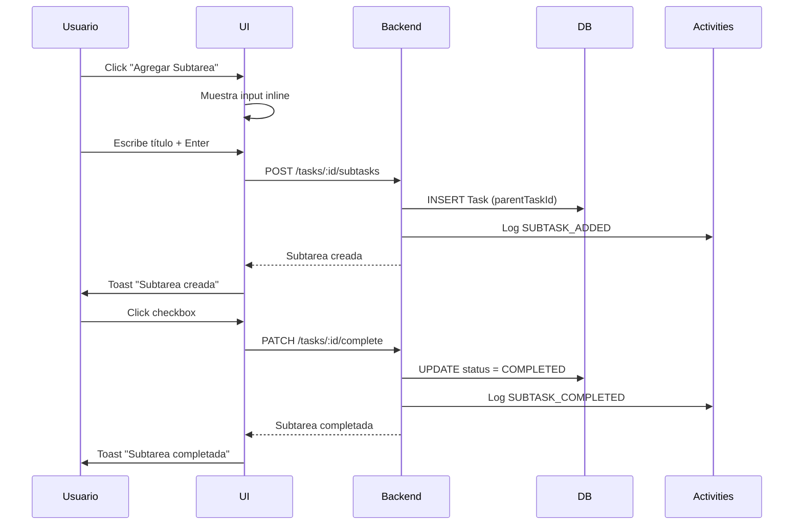
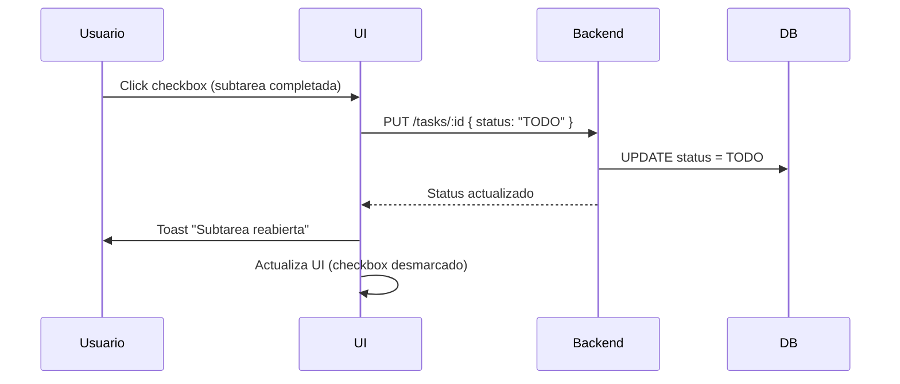
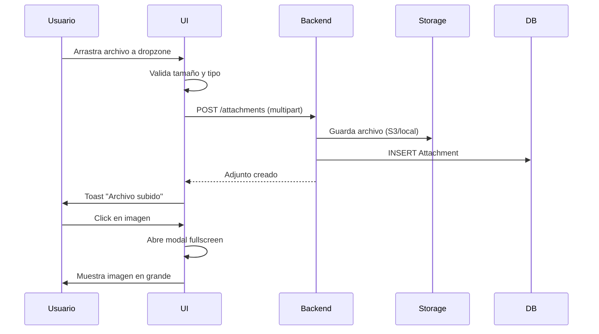

# Subtareas y Adjuntos - Documentación Técnica

**Fecha:** 4 de Diciembre, 2025  
**Versión:** 1.0  
**Estado:** ✅ Implementado y Funcional

---

## 📋 Tabla de Contenidos

1. [Subtareas](#subtareas)
2. [Adjuntos](#adjuntos)
3. [Arquitectura](#arquitectura)
4. [API Endpoints](#api-endpoints)
5. [Componentes UI](#componentes-ui)
6. [Flujos de Usuario](#flujos-de-usuario)
7. [Internacionalización](#internacionalización)

---

## Subtareas

### Descripción General

Las subtareas permiten dividir tareas complejas en pasos más pequeños y manejables. Cada subtarea es técnicamente una tarea independiente con una relación `parentTaskId` que la vincula a su tarea padre.

### Modelo de Datos

```prisma
model Task {
  id          String   @id @default(cuid())
  title       String
  status      TaskStatus @default(TODO)
  
  // Relación de subtareas (self-relation)
  parentTask  Task?    @relation("SubTasks", fields: [parentTaskId], references: [id])
  parentTaskId String?
  subTasks    Task[]   @relation("SubTasks")
  
  // ... otros campos
}
```

### Funcionalidades Implementadas

#### ✅ Crear Subtarea
- **Endpoint:** `POST /tasks/:parentTaskId/subtasks`
- **DTO:** `CreateSubtaskDto`
- **Hereda:** `projectId` del padre automáticamente
- **Logging:** Registra actividad `SUBTASK_ADDED` en el padre

#### ✅ Completar Subtarea
- **Endpoint:** `PATCH /tasks/:subtaskId/complete`
- **Comportamiento:** Marca status como `COMPLETED`
- **Logging:** Registra `SUBTASK_COMPLETED` en el padre

#### ✅ Reabrir Subtarea (Nuevo)
- **Endpoint:** `PUT /tasks/:subtaskId` con `{ status: "TODO" }`
- **Comportamiento:** Cambia status de `COMPLETED` a `TODO`
- **UI:** Toggle del checkbox permite reabrir
- **Notificación:** Toast "Subtarea reabierta" en 3 idiomas

#### ✅ Eliminar Subtarea
- **Endpoint:** `DELETE /tasks/:subtaskId`
- **Confirmación:** Dialog de confirmación antes de eliminar
- **Cascade:** Elimina automáticamente si se elimina el padre

### Barra de Progreso

El componente `SubtaskList` muestra progreso visual:

```typescript
const completedCount = subtasks.filter(st => st.status === "COMPLETED").length;
const totalCount = subtasks.length;
const progressPercentage = totalCount > 0 ? (completedCount / totalCount) * 100 : 0;
```

**Visualización:**
- Contador: `3/5` (completadas/total)
- Barra de progreso: 60% de ancho
- Porcentaje: `60%`

---

## Adjuntos

### Descripción General

Los adjuntos permiten subir archivos relacionados con una tarea. Soporta imágenes, documentos, videos y otros tipos de archivo.

### Modelo de Datos

```prisma
model Attachment {
  id          String   @id @default(cuid())
  taskId      String
  task        Task     @relation(fields: [taskId], references: [id], onDelete: Cascade)
  
  filename    String
  filesize    Int      // bytes
  mimeType    String
  url         String   // S3/R2 URL o path local
  
  uploadedBy  User?    @relation(fields: [uploadedById], references: [id])
  uploadedById String?
  uploadedAt  DateTime @default(now())
  
  @@index([taskId])
}
```

### Funcionalidades Implementadas

#### ✅ Subir Archivo
- **Componente:** `FileUpload`
- **Endpoint:** `POST /attachments`
- **Método:** Drag & drop o click para seleccionar
- **Límites:** Configurable (default: 10MB por archivo)
- **Validación:** Tipo de archivo y tamaño

#### ✅ Preview de Imágenes
- **Componente:** `AttachmentList`
- **Funcionalidad:** Modal fullscreen para imágenes
- **Soporte:** JPG, PNG, GIF, WebP
- **UI:** Hover overlay con botón "Preview"

#### ✅ Descargar Archivo
- **Método:** Link directo con `download` attribute
- **Notificación:** Toast "Descargando {filename}"
- **Compatibilidad:** Todos los navegadores modernos

#### ✅ Eliminar Archivo
- **Confirmación:** Dialog "¿Estás seguro de eliminar {filename}?"
- **Endpoint:** `DELETE /attachments/:id`
- **Cascade:** Elimina archivo del storage (S3/local)

### Tipos de Archivo Soportados

| Categoría | Icono | Tipos MIME |
|-----------|-------|------------|
| **Imágenes** | 🖼️ ImageIcon | `image/*` |
| **Videos** | 🎬 Film | `video/*` |
| **Audio** | 🎵 Music | `audio/*` |
| **Documentos** | 📄 FileText | `application/pdf`, `*word*`, `*excel*` |
| **Otros** | 📁 File | Cualquier otro |

### Visualización

```typescript
// Grid responsive
<div className="grid grid-cols-1 md:grid-cols-2 gap-3">
  {attachments.map(attachment => (
    // Card con preview, info y acciones
  ))}
</div>
```

**Información mostrada:**
- Nombre del archivo (truncado si es largo)
- Tamaño (formateado: KB, MB, GB)
- Fecha de subida (relativa: "hace 2 horas")
- Usuario que subió (opcional)

---

## Arquitectura

### Backend (NestJS)

```
apps/backend/src/
├── tasks/
│   ├── tasks.controller.ts      # POST /:id/subtasks
│   ├── tasks.service.ts          # createSubtask(), complete()
│   └── dto/
│       └── create-subtask.dto.ts # { title, description?, priority? }
├── attachments/
│   ├── attachments.controller.ts # POST, GET, DELETE
│   ├── attachments.service.ts
│   └── dto/
│       └── create-attachment.dto.ts
└── activities/
    └── activities.service.ts     # logSubtaskAdded(), logSubtaskCompleted()
```

### Frontend (Next.js)

```
apps/web/src/
├── components/task/
│   ├── subtask-list.tsx          # Lista de subtareas con CRUD
│   ├── attachment-list.tsx       # Grid de adjuntos con preview
│   └── file-upload.tsx           # Drag & drop upload
├── lib/
│   └── api-hooks.ts              # useCreateSubtask, useDeleteAttachment, etc.
└── messages/
    ├── en.json                   # Traducciones inglés
    ├── es.json                   # Traducciones español
    └── pt-br.json                # Traducciones portugués
```

---

## API Endpoints

### Subtareas

#### Crear Subtarea
```http
POST /tasks/:parentTaskId/subtasks
Authorization: Bearer {token}
Content-Type: application/json

{
  "title": "Revisar documentación",
  "description": "Opcional",
  "priority": "MEDIUM"
}
```

**Response:**
```json
{
  "id": "clx...",
  "title": "Revisar documentación",
  "status": "TODO",
  "parentTaskId": "parent-id",
  "projectId": "inherited-from-parent",
  "createdAt": "2025-12-04T14:00:00Z"
}
```

#### Completar Subtarea
```http
PATCH /tasks/:subtaskId/complete
Authorization: Bearer {token}
```

#### Reabrir Subtarea
```http
PUT /tasks/:subtaskId
Authorization: Bearer {token}
Content-Type: application/json

{
  "status": "TODO"
}
```

### Adjuntos

#### Subir Archivo
```http
POST /attachments
Authorization: Bearer {token}
Content-Type: multipart/form-data

file: [binary]
taskId: "task-id"
```

**Response:**
```json
{
  "id": "clx...",
  "filename": "screenshot.png",
  "filesize": 245678,
  "mimeType": "image/png",
  "url": "/uploads/clx.../screenshot.png",
  "uploadedAt": "2025-12-04T14:00:00Z"
}
```

#### Eliminar Archivo
```http
DELETE /attachments/:id
Authorization: Bearer {token}
```

---

## Componentes UI

### SubtaskList

**Props:**
```typescript
interface SubtaskListProps {
  taskId: string;
  subtasks?: Array<{
    id: string | number;
    title: string;
    status: string;
    position?: number;
  }>;
}
```

**Características:**
- Header con contador y barra de progreso
- Lista de subtareas con checkbox toggle
- Botón "Agregar Subtarea" con input inline
- Drag handle para reordenar (visual, no funcional aún)
- Botón eliminar en hover

**Estados:**
- `isAdding`: Muestra/oculta input de nueva subtarea
- `newSubtaskTitle`: Valor del input

**Hooks utilizados:**
- `useCreateSubtask()`: Crear nueva subtarea
- `useCompleteTask()`: Marcar como completada
- `useUpdateTask()`: Reabrir (cambiar status)
- `useDeleteTask()`: Eliminar subtarea

### AttachmentList

**Props:**
```typescript
interface AttachmentListProps {
  taskId: string;
  attachments?: Attachment[];
}
```

**Características:**
- Grid responsive (1 col mobile, 2 cols desktop)
- Preview de imágenes con modal
- Información detallada (tamaño, fecha, usuario)
- Acciones en hover: Preview, Download, Delete

**Estados:**
- `previewAttachment`: Adjunto seleccionado para preview

**Hooks utilizados:**
- `useDeleteAttachment()`: Eliminar archivo

### FileUpload

**Props:**
```typescript
interface FileUploadProps {
  taskId: string;
  onUploadComplete?: () => void;
  maxFileSize?: number; // MB
  acceptedTypes?: string[];
}
```

**Características:**
- Drag & drop zone
- Click para seleccionar archivos
- Validación de tamaño y tipo
- Progress bar durante upload
- Botón cancelar upload

---

## Flujos de Usuario

### Flujo: Crear y Completar Subtarea



### Flujo: Reabrir Subtarea



### Flujo: Subir y Preview Adjunto



---

## Internacionalización

### Claves de Traducción

#### SubtaskList

| Clave | EN | ES | PT-BR |
|-------|----|----|-------|
| `title` | Subtasks | Subtareas | Subtarefas |
| `empty` | No subtasks. Add one to split this task. | No hay subtareas. Agrega una para dividir esta tarea. | Sem subtarefas. Adicione uma para dividir esta tarefa. |
| `add` | Add Subtask | Agregar Subtarea | Adicionar Subtarefa |
| `placeholder` | Subtask title... | Título de la subtarea... | Título da subtarefa... |
| `toast.created` | Subtask created | Subtarea creada | Subtarefa criada |
| `toast.completed` | Subtask completed | Subtarea completada | Subtarefa concluída |
| `toast.reopened` | Subtask reopened | Subtarea reabierta | Subtarefa reaberta |
| `toast.deleted` | Subtask deleted | Subtarea eliminada | Subtarefa excluída |
| `confirmDelete` | Are you sure you want to delete this subtask? | ¿Estás seguro de eliminar esta subtarea? | Tem certeza que deseja excluir esta subtarefa? |

#### AttachmentList

| Clave | EN | ES | PT-BR |
|-------|----|----|-------|
| `title` | Files | Archivos | Arquivos |
| `empty` | No attachments yet. | No hay archivos adjuntos aún. | Ainda sem anexos. |
| `total` | total | total | total |
| `by` | by | por | por |
| `tooltips.preview` | Preview | Vista previa | Visualizar |
| `tooltips.download` | Download | Descargar | Baixar |
| `tooltips.delete` | Delete | Eliminar | Excluir |
| `toast.downloading` | Downloading {filename} | Descargando {filename} | Baixando {filename} |
| `toast.deleted` | File deleted | Archivo eliminado | Arquivo excluído |
| `confirmDelete` | Are you sure you want to delete {filename}? | ¿Estás seguro de eliminar {filename}? | Tem certeza que deseja excluir {filename}? |

### Uso en Componentes

```typescript
import { useTranslations } from 'next-intl';

export function SubtaskList({ taskId, subtasks }: SubtaskListProps) {
  const t = useTranslations('SubtaskList');
  
  return (
    <div>
      <h3>{t('title')}</h3>
      <button>{t('add')}</button>
      {/* ... */}
    </div>
  );
}
```

---

## Consideraciones de Seguridad

### Subtareas

1. **Validación de Permisos:** El usuario debe tener acceso a la tarea padre
2. **Herencia de Proyecto:** La subtarea hereda automáticamente el `projectId`
3. **Soft Delete:** Las subtareas se eliminan en cascada con el padre

### Adjuntos

1. **Validación de Tamaño:** Límite configurable (default: 10MB)
2. **Validación de Tipo:** Whitelist de MIME types permitidos
3. **Sanitización de Nombres:** Nombres de archivo sanitizados antes de guardar
4. **Virus Scanning:** Recomendado para producción (no implementado en MVP)
5. **Presigned URLs:** Para S3, usar URLs firmadas con expiración

---

## Mejoras Futuras

### Subtareas

- [ ] **Reordenar:** Drag & drop funcional para cambiar orden
- [ ] **Subtareas anidadas:** Permitir sub-subtareas (máximo 2 niveles)
- [ ] **Progreso en tarea padre:** Mostrar % de subtareas completadas
- [ ] **Bulk actions:** Completar/eliminar múltiples subtareas

### Adjuntos

- [ ] **Edición de nombres:** Renombrar archivos después de subir
- [ ] **Versiones:** Mantener historial de versiones de un archivo
- [ ] **Compartir:** Generar links públicos con expiración
- [ ] **Integración con Drive:** Subir directamente desde Google Drive/Dropbox
- [ ] **OCR:** Extraer texto de imágenes/PDFs
- [ ] **Thumbnails:** Generar previews para videos y PDFs

---

## Testing

### Tests Unitarios Recomendados

```typescript
// tasks.service.spec.ts
describe('TasksService - Subtasks', () => {
  it('should create subtask with inherited projectId', async () => {
    // Test implementation
  });
  
  it('should allow reopening completed subtask', async () => {
    // Test implementation
  });
  
  it('should delete subtasks when parent is deleted', async () => {
    // Test implementation
  });
});

// attachments.service.spec.ts
describe('AttachmentsService', () => {
  it('should validate file size', async () => {
    // Test implementation
  });
  
  it('should validate file type', async () => {
    // Test implementation
  });
  
  it('should delete file from storage when attachment is deleted', async () => {
    // Test implementation
  });
});
```

### Tests E2E Recomendados

```typescript
// subtasks.e2e.spec.ts
describe('Subtasks Flow', () => {
  it('should create, complete, and reopen subtask', async () => {
    // 1. Navigate to task detail
    // 2. Click "Add Subtask"
    // 3. Enter title and submit
    // 4. Verify subtask appears
    // 5. Click checkbox to complete
    // 6. Verify toast "Subtask completed"
    // 7. Click checkbox again to reopen
    // 8. Verify toast "Subtask reopened"
  });
});

// attachments.e2e.spec.ts
describe('Attachments Flow', () => {
  it('should upload, preview, and delete attachment', async () => {
    // 1. Navigate to task detail
    // 2. Drag file to dropzone
    // 3. Verify upload progress
    // 4. Verify file appears in list
    // 5. Click on image
    // 6. Verify modal opens
    // 7. Close modal
    // 8. Click delete button
    // 9. Confirm deletion
    // 10. Verify file removed
  });
});
```

---

## Changelog

### v1.0 - 4 de Diciembre, 2025
- ✅ Implementada funcionalidad de reabrir subtareas
- ✅ Agregadas traducciones en 3 idiomas (en, es, pt-BR)
- ✅ Documentación completa creada

### v0.9 - Noviembre 2025
- ✅ Implementación inicial de subtareas (crear, completar, eliminar)
- ✅ Implementación de adjuntos (subir, preview, descargar, eliminar)
- ✅ Barra de progreso visual
- ✅ Logging de actividades

---

**Última actualización:** 4 de Diciembre, 2025  
**Autor:** Equipo Ordo-Todo  
**Revisión:** v1.0
