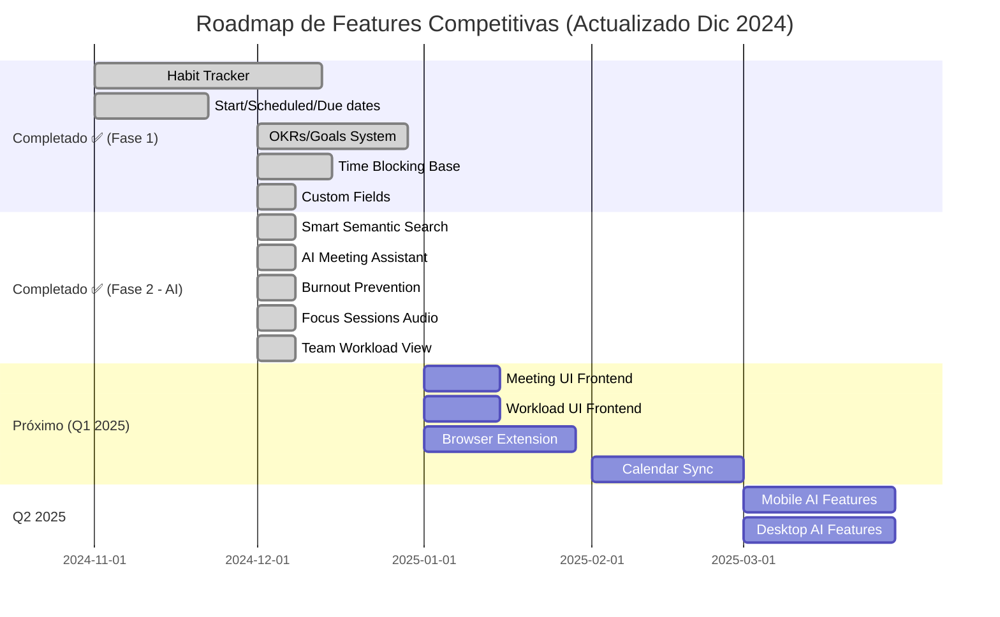

# 🎯 Análisis Competitivo - Ordo-Todo

## Objetivo
Identificar funcionalidades faltantes y oportunidades de mejora para que Ordo-Todo se convierta en la mejor aplicación de productividad y gestión de proyectos del mundo.

---

## 📊 Estado Actual de Ordo-Todo

### ✅ Lo que ya tienen (y es excelente):
| Feature | Estado | Comentario |
|---------|--------|------------|
| **Pomodoro Timer Avanzado** | ✅ | Cambio de tarea en vuelo, completado continuo - *diferenciador único* |
| **IA como Copiloto** | 🟡 50-80% | Smart scheduling, auto-categorización, estimación de tiempo |
| **Multiplataforma** | ✅ | Web, Mobile, Desktop (Electron) |
| **i18n** | ✅ | ES, EN, PT-BR |
| **Gamificación** | ✅ | XP, niveles, logros |
| **Clean Architecture** | ✅ | DDD + Monorepo - excelente base técnica |
| **Sincronización en tiempo real** | ✅ | WebSocket |
| **Modo offline** | ✅ | |
| **Subtareas** | ✅ | Con progress tracking |
| **Recurrencia de tareas** | ✅ | |
| **Attachments** | ✅ | Drag & drop, previews |
| **Workspaces** | ✅ | Personal/Trabajo/Equipos |
| **Vistas múltiples** | ✅ | Lista, Kanban, Calendario |

---

## 🔴 Análisis de la Competencia: Fortalezas y Debilidades

### 1. **Todoist** - El Simple pero Poderoso

#### ✅ Fortalezas (copiar):
- **Procesamiento de Lenguaje Natural excepcional** - "Reunión mañana 3pm #trabajo p1"
- **Quick Add ultrarrápido** - Desde cualquier pantalla con shortcut global
- **Filtros personalizados muy potentes** - Combinables con lógica booleana
- **Karma System** - Gamificación simple pero efectiva
- **Integración profunda con calendarios externos**
- **Recordatorios basados en ubicación** (llegar/salir de un lugar)

#### 🔴 Debilidades (oportunidad para Ordo-Todo):
| Problema de Usuarios | Cómo Ordo-Todo puede ser mejor |
|---------------------|-------------------------------|
| Sincronización inconsistente reportada | Asegurar sync robust con retry automático |
| Quick Add en macOS/iOS fallan a veces | Implementar quick add nativo ultraconfiable |
| Tareas recurrentes aparecen como "vencidas" en vez de rollover | Opción de rollover automático configurable |
| Subtareas pierden contexto en vista "Hoy" | Mostrar breadcrumb del padre en subtareas |
| Sin fecha de inicio (solo vencimiento) | ✅ **AGREGAR: Fecha de inicio ("Start Date")** |
| Sin Gantt chart nativo | Ustedes ya lo tienen planificado |
| Sin Pomodoro integrado | ✅ **YA LO TIENEN - VENTAJA** |
| Calendar view requiere plan pago | Ofrecer en free tier con limitaciones |

---

### 2. **Notion** - El Todo-en-Uno

#### ✅ Fortalezas (copiar):
- **Flexibilidad extrema** - Usuarios construyen sistemas personalizados
- **Databases con propiedades personalizadas** - Custom fields ilimitados
- **Múltiples vistas del mismo dataset** - Lista, Kanban, Calendario, Timeline, Gallery
- **Templates compartibles** - Marketplace de templates
- **AI Q&A sobre tu contenido** - Buscar en tu knowledge base con IA
- **Sub-items nativos** - Tareas dentro de tareas con relaciones

#### 🔴 Debilidades (oportunidad para Ordo-Todo):
| Problema de Usuarios | Cómo Ordo-Todo puede ser mejor |
|---------------------|-------------------------------|
| **Lento y laggy** con databases grandes | Optimizar performance - virtual scrolling, lazy loading |
| **"Fake productivity"** - usuarios gastan tiempo organizando en vez de haciendo | UI simple por defecto, opciones avanzadas ocultas |
| **Sin tareas recurrentes nativas** (requiere workarounds) | ✅ **YA LO TIENEN** |
| **App móvil pobre para tareas** | Invertir en UX móvil excepcional |
| **Curva de aprendizaje alta** | Onboarding guiado, templates preconfigurados |
| **Sin modo offline robusto** | ✅ **YA LO TIENEN** |
| **IA integrada causa lag y distracción** | IA no intrusiva, solo cuando se solicita |

---

### 3. **TickTick** - El Completo

#### ✅ Fortalezas (copiar):
- **Habit Tracker integrado** - ⚠️ **FEATURE CRÍTICO QUE FALTA**
- **Matriz de Eisenhower nativa** - Urgente/Importante visual
- **Pomodoro integrado con estadísticas** - Lo tienen pero ¿tienen stats por tarea?
- **Calendario con time-blocking** - Vista de 7 días
- **White noise/sonidos de fondo** - Para concentración
- **Widget nativo muy bueno** (Android/iOS)

#### 🔴 Debilidades (oportunidad para Ordo-Todo):
| Problema de Usuarios | Cómo Ordo-Todo puede ser mejor |
|---------------------|-------------------------------|
| Sync lento y laggy | Priorizar sync robusto |
| UI anticuada en mobile | Diseño moderno, micro-interacciones |
| Pomodoro muy básico | ✅ **EL DE USTEDES ES MEJOR** |
| Sin fecha "deadline" separada de "fecha programada" | Agregar distinción due date vs scheduled date |
| Discoverability pobre - features ocultas | Tour interactivo, hints contextuales |

---

### 4. **Things 3** (Solo Apple) - La Experiencia Premium

#### ✅ Fortalezas (copiar):
- **Diseño visual impecable** - Referencia de UX
- **"Today", "Upcoming", "Anytime", "Someday"** - Vistas GTD nativas
- **Headings dentro de proyectos** - Organización visual
- **Quick Entry con Markdown** - Notas ricas
- **No es subscription** - Compra única (percepción de valor)

#### 🔴 Debilidades (oportunidad para Ordo-Todo):
| Problema que tienen | Ventaja de Ordo-Todo |
|---------------------|---------------------|
| **Solo Apple** | ✅ **MULTIPLATAFORMA** |
| **Sin colaboración** | ✅ **TIENEN EQUIPOS** |
| **Sin IA** | ✅ **TIENEN IA** |
| **Sin web app** | ✅ **TIENEN** |

---

### 5. **ClickUp** - El Enterprise Monster

#### ✅ Fortalezas (copiar):
- **Custom fields muy potentes** - Dropdowns, números, fórmulas
- **Multiple assignees** - Varios responsables por tarea
- **Docs integrados** - Wiki dentro del PM
- **Whiteboards** - Colaboración visual
- **Time tracking nativo**
- **Automations muy potentes** - If-then workflows

#### 🔴 Debilidades (oportunidad para Ordo-Todo):
| Problema de Usuarios | Cómo Ordo-Todo puede ser mejor |
|---------------------|-------------------------------|
| **MUY LENTO** - 10-25 seg por página | Performance como prioridad absoluta |
| **Demasiados bugs** - Dependencies que se revierten | Testing exhaustivo, QA robusto |
| **UI abrumadora** - Demasiadas opciones | Progressive disclosure, simplicidad |
| **Soporte lento** - Tickets tardan meses | Soporte responsive |
| **Features > Estabilidad** - Agregan nuevo sin arreglar viejo | Estabilidad primero |

---

## 🚀 FUNCIONALIDADES FALTANTES CRÍTICAS

### 🔥 Prioridad ALTA (Diferenciadores Competitivos)

#### 1. **Habit Tracker Integrado** ⭐⭐⭐⭐⭐ ✅ COMPLETADO
> *TickTick lo tiene y es su mayor diferenciador*

**Estado:** ✅ Implementado completamente
- Hábitos con streaks visuales
- Estadísticas de cumplimiento
- Diferentes frecuencias (diario, semanal, etc.)
- Recordatorios específicos
- Gamificación con XP

---

#### 2. **Start Date + Scheduled Date separadas de Due Date** ⭐⭐⭐⭐⭐ ✅ COMPLETADO
> *Queja #1 de usuarios de Todoist*

**Estado:** ✅ Implementado completamente
- Start Date: Cuando puedo empezar a trabajar en esto
- Scheduled Date: Cuando planeo hacerlo  
- Due Date: Fecha límite real
- Vista "Today" filtra correctamente

---

#### 3. **OKRs / Goals System** ⭐⭐⭐⭐ ✅ COMPLETADO
> *Asana, ClickUp, Lattice lo tienen*

**Estado:** ✅ Implementado completamente
- Crear Objetivos con Key Results medibles
- Vincular tareas a Objetivos
- Dashboard de progreso hacia goals
- Métricas: Porcentaje, Número, Moneda, Booleano
- UI completa en Web, Desktop y Mobile

---

#### 4. **Calendario con Time Blocking REAL** ⭐⭐⭐⭐ ✅ COMPLETADO
> *TickTick, Calendar AI lo tienen*

**Estado:** ✅ Implementación completa
- scheduledTime y scheduledEndTime
- isTimeBlocked para mostrar en calendario
- Vista semanal con bloques

**Pendiente:**
- Drag & drop de tareas al calendario
- AI que sugiere slots óptimos
- Sincronización bidireccional con Google/Outlook

---

#### 5. **Custom Fields / Properties** ⭐⭐⭐⭐ ✅ COMPLETADO
> *Notion, ClickUp lo tienen - usuarios lo piden constantemente*

**Estado:** ✅ Implementado completamente (Diciembre 2024)
- 8 tipos de campo: TEXT, NUMBER, SELECT, MULTI_SELECT, DATE, URL, EMAIL, CHECKBOX
- Editor en Project Settings
- Integración en formularios de tarea
- Web, Desktop y Mobile
- i18n completo

---

### 🤖 AI Features (NUEVO - Diciembre 2024)

#### 6. **Smart Semantic Search** ⭐⭐⭐⭐⭐ ✅ COMPLETADO
> *Notion AI, Linear, Height lo tienen*

**Estado:** ✅ Implementado completamente
- Búsqueda en lenguaje natural ("tareas urgentes de esta semana")
- Interpretación de queries con Gemini AI
- Búsqueda multi-entidad (tareas, proyectos, hábitos)
- Autocompletado inteligente
- Q&A natural sobre datos

---

#### 7. **AI Meeting Assistant** ⭐⭐⭐⭐ ✅ COMPLETADO
> *Fireflies, Otter, Notion AI lo tienen*

**Estado:** ✅ Backend completo, UI pendiente
- Análisis de transcripciones
- Extracción de action items
- Detección de decisiones y participantes
- Conversión a tareas
- Análisis de sentimiento

---

#### 8. **Burnout Prevention Engine** ⭐⭐⭐⭐⭐ ✅ COMPLETADO
> *ÚNICO - Ningún competidor tiene esto*

**Estado:** ✅ Implementado completamente
- Risk Score 0-100 con niveles
- Análisis de patrones de trabajo
- Recomendaciones personalizadas
- Intervenciones no intrusivas
- Weekly wellbeing summary

---

#### 9. **Focus Sessions con Música/Ambient** ⭐⭐⭐⭐ ✅ COMPLETADO
> *TickTick, Brain.fm, Focus@Will lo tienen*

**Estado:** ✅ Implementado completamente
- Sonidos de lluvia, café, naturaleza
- Beats binaurales
- Modos de enfoque (Pomodoro, Deep Work, Flow)
- Favoritos y preferencias
- Estadísticas de focus

---

#### 10. **Team Workload View** ⭐⭐⭐⭐ ✅ COMPLETADO
> *ClickUp, Monday.com, Asana lo tienen*

**Estado:** ✅ Backend completo, UI pendiente
- Ver carga de trabajo de cada miembro
- Workload Score 0-100
- Sugerencias de redistribución
- Identificar sobrecarga/subutilización

---

### ⚡ Quick Wins (Fáciles de Implementar)

| Feature | Esfuerzo | Impacto | Estado |
|---------|----------|---------|--------|
| **Location-based reminders** | Medio | Alto | 📝 Pendiente |
| **Eisenhower Matrix view** | Bajo | Medio | ✅ Completado |
| **Daily/Weekly email digest** | Bajo | Alto | 📝 Pendiente |
| **Public roadmap votable** | Bajo | Alto | 📝 Pendiente |
| **Batch task editing** | Bajo | Alto | ✅ Completado |
| **Quick filters presets** | Bajo | Medio | ✅ Completado |
| **Keyboard shortcut cheat sheet** | Muy bajo | Medio | ✅ Completado |
| **Export JSON/CSV** | Bajo | Medio | ✅ Completado |

---

## 💡 Recomendaciones Estratégicas

### 1. **Posicionamiento Diferenciador**
> "La app de productividad que combina la simplicidad de Todoist, el poder de ClickUp, y la belleza de Things - con **IA que cuida tu bienestar**"

### 2. **Modelo de Pricing Competitivo**
| Plan | Precio | Diferenciación |
|------|--------|----------------|
| Free | $0 | Más generoso que Todoist free (más tareas, calendar view) |
| Pro | $6-8/mes | Más barato que Todoist Pro ($5) pero con más features |
| Team | $10/user | Más barato que ClickUp Team ($12) |

### 3. **Foco de Marketing**
- **Timer Pomodoro superior** - Ningún competidor lo tiene tan bien
- **Burnout Prevention** - ÚNICO en el mercado
- **AI que no estorba** - A diferencia de Notion AI que causa lag
- **Performance garantizado** - Contra ClickUp lento

---

## 🎯 Roadmap Actualizado de Features

---

## 📈 Métricas de Éxito

Para superar a la competencia, monitorear:

1. **Time to First Task** - < 30 segundos
2. **Sync Latency** - < 500ms
3. **Mobile App Rating** - Mantener > 4.5 stars
4. **Feature Parity Score** vs competidores - Target 95%
5. **NPS** - Target > 50

---

## 🔗 Fuentes de Investigación

- Reddit r/todoist, r/TickTick, r/Notion
- Product Hunt reviews
- G2/Capterra comparisons
- Twitter/X user complaints
- Forbes, Zapier articles on productivity apps 2024

---

## Conclusiones

**Ordo-Todo tiene una base técnica excelente y features únicos (Pomodoro avanzado, cambio de tarea en vuelo, Burnout Prevention).** 

### ✅ Logros (Diciembre 2024)

| Feature | Estado | Impacto |
|---------|--------|---------|
| **Habit Tracker** | ✅ Completado | Alto - Diferenciador vs Todoist |
| **Start/Scheduled/Due Dates** | ✅ Completado | Alto - Soluciona queja #1 |
| **OKRs/Goals System** | ✅ Completado | Alto - Diferenciador vs apps simples |
| **Time Blocking** | ✅ Completado | Medio - Falta D&D y sync |
| **Custom Fields** | ✅ Completado | Alto - Paridad con Notion/ClickUp |
| **Smart Semantic Search** | ✅ Completado | Alto - AI diferenciador |
| **AI Meeting Assistant** | ✅ Backend | Alto - Feature premium |
| **Burnout Prevention** | ✅ Completado | MUY ALTO - ÚNICO en mercado |
| **Focus Audio** | ✅ Completado | Medio - Paridad con TickTick |
| **Team Workload** | ✅ Backend | Alto - Enterprise feature |

### 🎯 Próximos Pasos

1. ⭐ **Frontend UI** - Meeting Assistant, Workload Dashboard
2. ⭐ **Browser Extension** - Quick capture desde cualquier página
3. ⭐ **Calendar Sync** - Google/Outlook bidireccional
4. ⭐ **Mobile/Desktop AI** - Paridad de features AI
5. ⭐ **Performance audit** - Optimización continua

---

**Última actualización:** 16 Diciembre 2024

