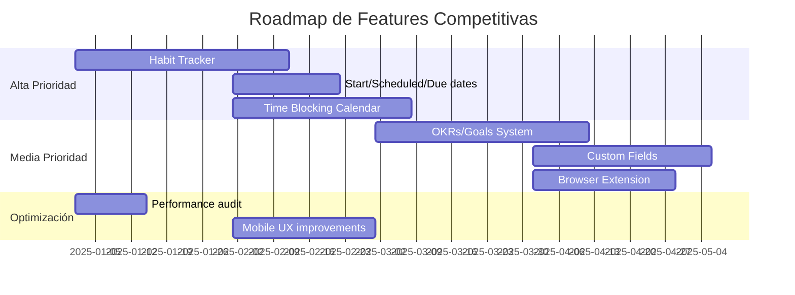

# 🎯 Análisis Competitivo - Ordo-Todo

## Objetivo
Identificar funcionalidades faltantes y oportunidades de mejora para que Ordo-Todo se convierta en la mejor aplicación de productividad y gestión de proyectos del mundo.

---

## 📊 Estado Actual de Ordo-Todo

### ✅ Lo que ya tienen (y es excelente):
| Feature | Estado | Comentario |
|---------|--------|------------|
| **Pomodoro Timer Avanzado** | ✅ | Cambio de tarea en vuelo, completado continuo - *diferenciador único* |
| **IA como Copiloto** | 🟡 50-80% | Smart scheduling, auto-categorización, estimación de tiempo |
| **Multiplataforma** | ✅ | Web, Mobile, Desktop (Electron) |
| **i18n** | ✅ | ES, EN, PT-BR |
| **Gamificación** | ✅ | XP, niveles, logros |
| **Clean Architecture** | ✅ | DDD + Monorepo - excelente base técnica |
| **Sincronización en tiempo real** | ✅ | WebSocket |
| **Modo offline** | ✅ | |
| **Subtareas** | ✅ | Con progress tracking |
| **Recurrencia de tareas** | ✅ | |
| **Attachments** | ✅ | Drag & drop, previews |
| **Workspaces** | ✅ | Personal/Trabajo/Equipos |
| **Vistas múltiples** | ✅ | Lista, Kanban, Calendario |

---

## 🔴 Análisis de la Competencia: Fortalezas y Debilidades

### 1. **Todoist** - El Simple pero Poderoso

#### ✅ Fortalezas (copiar):
- **Procesamiento de Lenguaje Natural excepcional** - "Reunión mañana 3pm #trabajo p1"
- **Quick Add ultrarrápido** - Desde cualquier pantalla con shortcut global
- **Filtros personalizados muy potentes** - Combinables con lógica booleana
- **Karma System** - Gamificación simple pero efectiva
- **Integración profunda con calendarios externos**
- **Recordatorios basados en ubicación** (llegar/salir de un lugar)

#### 🔴 Debilidades (oportunidad para Ordo-Todo):
| Problema de Usuarios | Cómo Ordo-Todo puede ser mejor |
|---------------------|-------------------------------|
| Sincronización inconsistente reportada | Asegurar sync robust con retry automático |
| Quick Add en macOS/iOS fallan a veces | Implementar quick add nativo ultraconfiable |
| Tareas recurrentes aparecen como "vencidas" en vez de rollover | Opción de rollover automático configurable |
| Subtareas pierden contexto en vista "Hoy" | Mostrar breadcrumb del padre en subtareas |
| Sin fecha de inicio (solo vencimiento) | ✅ **AGREGAR: Fecha de inicio ("Start Date")** |
| Sin Gantt chart nativo | Ustedes ya lo tienen planificado |
| Sin Pomodoro integrado | ✅ **YA LO TIENEN - VENTAJA** |
| Calendar view requiere plan pago | Ofrecer en free tier con limitaciones |

---

### 2. **Notion** - El Todo-en-Uno

#### ✅ Fortalezas (copiar):
- **Flexibilidad extrema** - Usuarios construyen sistemas personalizados
- **Databases con propiedades personalizadas** - Custom fields ilimitados
- **Múltiples vistas del mismo dataset** - Lista, Kanban, Calendario, Timeline, Gallery
- **Templates compartibles** - Marketplace de templates
- **AI Q&A sobre tu contenido** - Buscar en tu knowledge base con IA
- **Sub-items nativos** - Tareas dentro de tareas con relaciones

#### 🔴 Debilidades (oportunidad para Ordo-Todo):
| Problema de Usuarios | Cómo Ordo-Todo puede ser mejor |
|---------------------|-------------------------------|
| **Lento y laggy** con databases grandes | Optimizar performance - virtual scrolling, lazy loading |
| **"Fake productivity"** - usuarios gastan tiempo organizando en vez de haciendo | UI simple por defecto, opciones avanzadas ocultas |
| **Sin tareas recurrentes nativas** (requiere workarounds) | ✅ **YA LO TIENEN** |
| **App móvil pobre para tareas** | Invertir en UX móvil excepcional |
| **Curva de aprendizaje alta** | Onboarding guiado, templates preconfigurados |
| **Sin modo offline robusto** | ✅ **YA LO TIENEN** |
| **IA integrada causa lag y distracción** | IA no intrusiva, solo cuando se solicita |

---

### 3. **TickTick** - El Completo

#### ✅ Fortalezas (copiar):
- **Habit Tracker integrado** - ⚠️ **FEATURE CRÍTICO QUE FALTA**
- **Matriz de Eisenhower nativa** - Urgente/Importante visual
- **Pomodoro integrado con estadísticas** - Lo tienen pero ¿tienen stats por tarea?
- **Calendario con time-blocking** - Vista de 7 días
- **White noise/sonidos de fondo** - Para concentración
- **Widget nativo muy bueno** (Android/iOS)

#### 🔴 Debilidades (oportunidad para Ordo-Todo):
| Problema de Usuarios | Cómo Ordo-Todo puede ser mejor |
|---------------------|-------------------------------|
| Sync lento y laggy | Priorizar sync robusto |
| UI anticuada en mobile | Diseño moderno, micro-interacciones |
| Pomodoro muy básico | ✅ **EL DE USTEDES ES MEJOR** |
| Sin fecha "deadline" separada de "fecha programada" | Agregar distinción due date vs scheduled date |
| Discoverability pobre - features ocultas | Tour interactivo, hints contextuales |

---

### 4. **Things 3** (Solo Apple) - La Experiencia Premium

#### ✅ Fortalezas (copiar):
- **Diseño visual impecable** - Referencia de UX
- **"Today", "Upcoming", "Anytime", "Someday"** - Vistas GTD nativas
- **Headings dentro de proyectos** - Organización visual
- **Quick Entry con Markdown** - Notas ricas
- **No es subscription** - Compra única (percepción de valor)

#### 🔴 Debilidades (oportunidad para Ordo-Todo):
| Problema que tienen | Ventaja de Ordo-Todo |
|---------------------|---------------------|
| **Solo Apple** | ✅ **MULTIPLATAFORMA** |
| **Sin colaboración** | ✅ **TIENEN EQUIPOS** |
| **Sin IA** | ✅ **TIENEN IA** |
| **Sin web app** | ✅ **TIENEN** |

---

### 5. **ClickUp** - El Enterprise Monster

#### ✅ Fortalezas (copiar):
- **Custom fields muy potentes** - Dropdowns, números, fórmulas
- **Multiple assignees** - Varios responsables por tarea
- **Docs integrados** - Wiki dentro del PM
- **Whiteboards** - Colaboración visual
- **Time tracking nativo**
- **Automations muy potentes** - If-then workflows

#### 🔴 Debilidades (oportunidad para Ordo-Todo):
| Problema de Usuarios | Cómo Ordo-Todo puede ser mejor |
|---------------------|-------------------------------|
| **MUY LENTO** - 10-25 seg por página | Performance como prioridad absoluta |
| **Demasiados bugs** - Dependencies que se revierten | Testing exhaustivo, QA robusto |
| **UI abrumadora** - Demasiadas opciones | Progressive disclosure, simplicidad |
| **Soporte lento** - Tickets tardan meses | Soporte responsive |
| **Features > Estabilidad** - Agregan nuevo sin arreglar viejo | Estabilidad primero |

---

## 🚀 FUNCIONALIDADES FALTANTES CRÍTICAS

### 🔥 Prioridad ALTA (Diferenciadores Competitivos)

#### 1. **Habit Tracker Integrado** ⭐⭐⭐⭐⭐
> *TickTick lo tiene y es su mayor diferenciador*

```
Propuesta:
- Hábitos como tipo especial de "tarea recurrente"
- Streaks visuales (racha de días)
- Estadísticas de cumplimiento
- Diferentes frecuencias (diario, 3x semana, etc.)
- Recordatorios específicos
- Gamificación extra para hábitos
```

**Porque importa:** Los usuarios quieren una sola app para tareas Y hábitos. Actualmente usan 2 apps.

---

#### 2. **Start Date + Scheduled Date separadas de Due Date** ⭐⭐⭐⭐⭐
> *Queja #1 de usuarios de Todoist*

```
Propuesta:
- Start Date: Cuando puedo empezar a trabajar en esto
- Scheduled Date: Cuando planeo hacerlo  
- Due Date: Fecha límite real

Beneficio: Las tareas no aparecen antes de poder hacerse.
Vista "Upcoming" muestra solo lo que ya puede comenzarse.
```

---

#### 3. **OKRs / Goals System** ⭐⭐⭐⭐
> *Asana, ClickUp, Lattice lo tienen*

```
Propuesta:
- Crear Objetivos con Key Results medibles
- Vincular tareas a Objetivos
- Dashboard de progreso hacia goals
- Quarterly reviews automáticos
- AI que sugiere tareas que impactan goals
```

**Porque importa:** Los usuarios quieren ver cómo sus tareas contribuyen a metas mayores.

---

#### 4. **Calendario con Time Blocking REAL** ⭐⭐⭐⭐
> *TickTick, Calendar AI lo tienen*

```
Propuesta:
- Arrastrar tareas al calendario asigna horario
- Estimación de duración visible
- Conflictos detectados automáticamente
- AI que sugiere slots óptimos
- Sincronización bidireccional con Google/Outlook
```

---

#### 5. **Custom Fields / Properties** ⭐⭐⭐⭐
> *Notion, ClickUp lo tienen - usuarios lo piden constantemente*

```
Propuesta:
- Campos personalizados por proyecto:
  - Dropdown (ej: Sprint, Cliente)
  - Number (ej: Story Points)
  - Date (ej: Fecha revisión)
  - URL, Email
  - Person (asignado secundario)
- Filtrar por custom fields
- Reportes por custom fields
```

---

### 📊 Prioridad MEDIA (Nice-to-have competitivos)

#### 6. **AI Meeting Assistant**
```
- Transcripción de reuniones (Fireflies, Otter style)
- Extracción automática de action items → tareas
- Resumen con IA
- Integración con Zoom/Meet/Teams
```

#### 7. **Smart Search Semántico**
```
- "Muéstrame las tareas de diseño urgentes de la semana pasada"
- Búsqueda por contenido de notas
- Comandos en lenguaje natural
```

#### 8. **Browser Extension**
```
- Quick capture desde cualquier página
- Crear tarea desde email (Gmail/Outlook)
- Crear tarea desde mensaje Slack
- Guardar URLs como tareas
```

#### 9. **Team Workload View**
```
- Ver carga de trabajo de cada miembro
- Balanceador de tareas
- Identificar cuellos de botella
- Capacity planning
```

#### 10. **Focus Sessions con Música/Ambient**
```
- Sonidos de lluvia, café, naturaleza
- Integración con Spotify
- Stats de tiempo en focus
- Bloqueo de distracciones (website blocker)
```

---

### ⚡ Quick Wins (Fáciles de Implementar)

| Feature | Esfuerzo | Impacto |
|---------|----------|---------|
| **Location-based reminders** | Medio | Alto |
| **Eisenhower Matrix view** | Bajo | Medio |
| **Daily/Weekly email digest** | Bajo | Alto |
| **Public roadmap votable** | Bajo | Alto |
| **Batch task editing** | Bajo | Alto |
| **Quick filters presets** | Bajo | Medio |
| **Keyboard shortcut cheat sheet** | Muy bajo | Medio |

---

## 💡 Recomendaciones Estratégicas

### 1. **Posicionamiento Diferenciador**
> "La app de productividad que combina la simplicidad de Todoist, el poder de ClickUp, y la belleza de Things - con IA que realmente ayuda"

### 2. **Modelo de Pricing Competitivo**
| Plan | Precio | Diferenciación |
|------|--------|----------------|
| Free | $0 | Más generoso que Todoist free (más tareas, calendar view) |
| Pro | $6-8/mes | Más barato que Todoist Pro ($5) pero con más features |
| Team | $10/user | Más barato que ClickUp Team ($12) |

### 3. **Foco de Marketing**
- **Timer Pomodoro superior** - Ningún competidor lo tiene tan bien
- **Sin subscription (opción)** - Como Things, pero multiplataforma
- **AI que no estorba** - A diferencia de Notion AI que causa lag
- **Performance garantizado** - Contra ClickUp lento

---

## 🎯 Roadmap Sugerido de Features Nuevas



---

## 📈 Métricas de Éxito

Para superar a la competencia, monitorear:

1. **Time to First Task** - < 30 segundos
2. **Sync Latency** - < 500ms
3. **Mobile App Rating** - Mantener > 4.5 stars
4. **Feature Parity Score** vs competidores - Target 95%
5. **NPS** - Target > 50

---

## 🔗 Fuentes de Investigación

- Reddit r/todoist, r/TickTick, r/Notion
- Product Hunt reviews
- G2/Capterra comparisons
- Twitter/X user complaints
- Forbes, Zapier articles on productivity apps 2024

---

## Conclusiones

**Ordo-Todo tiene una base técnica excelente y features únicos (Pomodoro avanzado, cambio de tarea en vuelo).** 

Para ser "la mejor del mundo", enfocarse en:

1. ⭐ **Habit Tracker** - El feature más pedido que falta
2. ⭐ **Start Dates** - Soluciona frustraciones comunes
3. ⭐ **Performance impecable** - Diferenciador vs ClickUp
4. ⭐ **UX móvil premium** - Diferenciador vs Notion
5. ⭐ **IA no intrusiva** - Diferenciador vs todos

