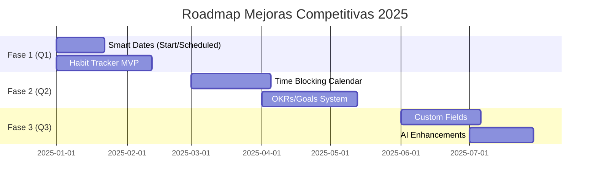

# 🎯 Mejoras Competitivas - Ordo-Todo

Esta carpeta contiene la planificación detallada para las funcionalidades que harán de Ordo-Todo **la mejor aplicación de productividad del mundo**.

## 📊 Índice de Documentos

| Prioridad | Documento | Feature | Estado |
|-----------|-----------|---------|--------|
| ⭐⭐⭐⭐⭐ | [01-HABIT-TRACKER.md](./01-HABIT-TRACKER.md) | Sistema de Hábitos | 📝 Planificado |
| ⭐⭐⭐⭐⭐ | [02-SMART-DATES.md](./02-SMART-DATES.md) | Start Date + Scheduled Date | ✅ **Completado** |
| ⭐⭐⭐⭐ | [03-OKRS-GOALS.md](./03-OKRS-GOALS.md) | Sistema de OKRs y Metas | 📝 Planificado |
| ⭐⭐⭐⭐ | [04-TIME-BLOCKING.md](./04-TIME-BLOCKING.md) | Time Blocking Visual | 📝 Planificado |
| ⭐⭐⭐⭐ | [05-CUSTOM-FIELDS.md](./05-CUSTOM-FIELDS.md) | Campos Personalizados | 📝 Planificado |
| - | [COMPETITIVE-ANALYSIS.md](./COMPETITIVE-ANALYSIS.md) | Análisis de Competencia | ✅ Completo |

## 🏗️ Principios de Integración

### 1. **Flujo Natural**
Cada feature debe sentirse como parte orgánica de la app, no como un "addon".

### 2. **Progressive Disclosure**
Funciones avanzadas ocultas hasta que el usuario las necesite.

### 3. **Consistencia de UX**
Usar los mismos patrones visuales, shortcuts y navegación existentes.

### 4. **DDD Compliance**
Cada feature sigue la arquitectura DDD con su propio dominio en `packages/core`.

### 5. **Compatibilidad Multiplataforma**
Web, Desktop y Mobile deben tener paridad de features.

---

## 🔄 Roadmap de Implementación

---

## 📈 Métricas de Éxito

Para cada feature, mediremos:

1. **Adoption Rate** - % de usuarios que usan el feature
2. **Retention Impact** - Cambio en retención a 30/60/90 días
3. **Feature NPS** - Satisfacción específica del feature
4. **Time to Value** - Tiempo hasta primer uso exitoso

---

**Última actualización:** Diciembre 2025
