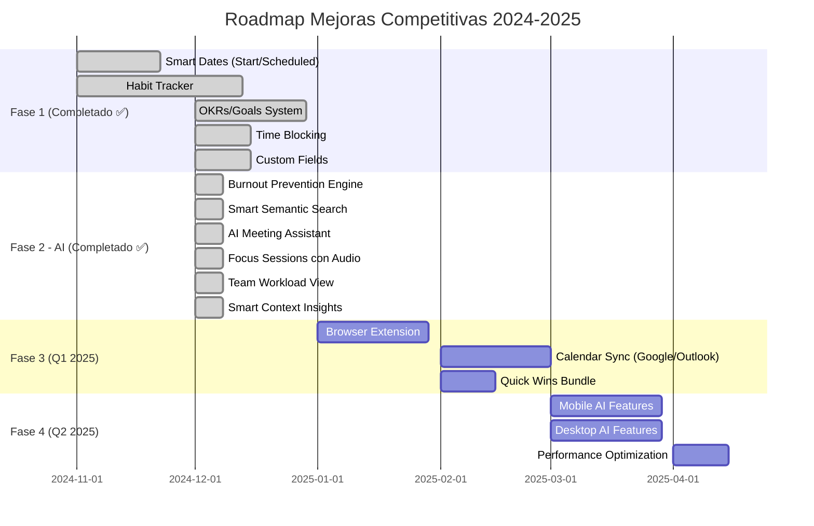

# 🎯 Mejoras Competitivas - Ordo-Todo

Esta carpeta contiene la planificación detallada para las funcionalidades que hacen de Ordo-Todo **la mejor aplicación de productividad del mundo**.

## 📊 Índice de Documentos

| Prioridad | Documento | Feature | Estado |
|-----------|-----------|---------|--------|
| ⭐⭐⭐⭐⭐ | [01-HABIT-TRACKER.md](./01-HABIT-TRACKER.md) | Sistema de Hábitos | ✅ **Completado** |
| ⭐⭐⭐⭐⭐ | [02-SMART-DATES.md](./02-SMART-DATES.md) | Start Date + Scheduled Date | ✅ **Completado** |
| ⭐⭐⭐⭐ | [03-OKRS-GOALS.md](./03-OKRS-GOALS.md) | Sistema de OKRs y Metas | ✅ **Completado** |
| ⭐⭐⭐⭐ | [04-TIME-BLOCKING.md](./04-TIME-BLOCKING.md) | Time Blocking Visual | ✅ **Completado** |
| ⭐⭐⭐⭐ | [05-CUSTOM-FIELDS.md](./05-CUSTOM-FIELDS.md) | Campos Personalizados | ✅ **Completado** |
| ⭐⭐⭐⭐⭐ | [06-AI-FEATURES.md](./06-AI-FEATURES.md) | AI Productivity Copilot | ✅ **Completado** |
| - | [COMPETITIVE-ANALYSIS.md](./COMPETITIVE-ANALYSIS.md) | Análisis de Competencia | ✅ Completo |

## ✅ Estado de Implementación (Diciembre 2024)

### Completados (100%) - Fase 1 & 2

#### Core Features ✅
- ✅ **Habit Tracker** - Sistema completo con streaks, estadísticas y gamificación
- ✅ **Smart Dates** - Start Date, Scheduled Date y Due Date separados
- ✅ **OKRs/Goals** - Objetivos con Key Results, vinculación de tareas
- ✅ **Time Blocking** - Calendario semanal con bloques de tiempo
- ✅ **Custom Fields** - 8 tipos de campo, editor en proyecto

#### AI Features ✅ (Nuevo - Diciembre 2024)
- ✅ **Smart Semantic Search** - Búsqueda en lenguaje natural con IA
- ✅ **AI Meeting Assistant** - Transcripción → Action items → Tareas
- ✅ **Burnout Prevention Engine** - Detección y recomendaciones de bienestar
- ✅ **Smart Context-Aware Insights** - Insights proactivos personalizados
- ✅ **Focus Sessions con Audio** - Sonidos ambient para concentración
- ✅ **Team Workload View** - Vista de carga del equipo

### Pendiente (Prioridad Media) - Fase 3

| Feature | Esfuerzo | Impacto | Estado |
|---------|----------|---------|--------|
| 📝 Browser Extension | Alto | Alto | Planificado Q1 2025 |
| 📝 Calendar Sync (Google/Outlook) | Alto | Alto | Planificado Q1 2025 |
| 📝 Eisenhower Matrix View | Bajo | Medio | Candidato |
| 📝 Batch Task Editing | Bajo | Alto | Candidato |
| 📝 Quick Filters Presets | Bajo | Medio | Candidato |
| 📝 Daily/Weekly Email Digest | Bajo | Alto | Candidato |

### Quick Wins Pendientes
- 📝 Keyboard shortcut cheat sheet (in-app)
- 📝 Location-based reminders (Mobile)
- 📝 Public roadmap votable
- 📝 Multiple assignees
- 📝 Task templates

---

## 🏗️ Principios de Integración

### 1. **Flujo Natural**
Cada feature debe sentirse como parte orgánica de la app, no como un "addon".

### 2. **Progressive Disclosure**
Funciones avanzadas ocultas hasta que el usuario las necesite.

### 3. **Consistencia de UX**
Usar los mismos patrones visuales, shortcuts y navegación existentes.

### 4. **DDD Compliance**
Cada feature sigue la arquitectura DDD con su propio dominio en `packages/core`.

### 5. **Compatibilidad Multiplataforma**
Web, Desktop y Mobile deben tener paridad de features.

---

## 🔄 Roadmap Actualizado

---

## 📈 Métricas de Éxito

Para cada feature, mediremos:

1. **Adoption Rate** - % de usuarios que usan el feature
2. **Retention Impact** - Cambio en retención a 30/60/90 días
3. **Feature NPS** - Satisfacción específica del feature
4. **Time to Value** - Tiempo hasta primer uso exitoso

---

## 🚀 Estado de Paridad Plataformas

| Feature | Web | Desktop | Mobile |
|---------|-----|---------|--------|
| Habit Tracker | ✅ | ✅ | ✅ |
| Smart Dates | ✅ | ✅ | ✅ |
| OKRs/Goals | ✅ | ✅ | ✅ |
| Time Blocking | ✅ | ✅ | 🟡 Parcial |
| Custom Fields | ✅ | ✅ | ✅ |
| Smart Search | ✅ | 🔜 | 🔜 |
| Meeting Assistant | ✅ Backend | 🔜 | 🔜 |
| Burnout Prevention | ✅ | 🔜 | 🔜 |
| Focus Audio | ✅ | 🔜 | 🔜 |
| Team Workload | ✅ Backend | 🔜 | 🔜 |

---

## 📝 Lo que falta para Web Perfecta

### Crítico (Antes de Release)
- [ ] Frontend UI para Meeting Assistant
- [ ] Frontend UI para Team Workload View
- [ ] Wellbeing Dashboard (Burnout metrics)
- [ ] Settings para AI features
- [ ] Tour de onboarding para nuevas features

### Nice to Have
- [ ] Keyboard shortcut overlay (Ctrl+?)
- [ ] Batch task operations
- [ ] Saved search filters
- [ ] Export de datos (JSON/CSV)

---

**Última actualización:** 16 Diciembre 2024
