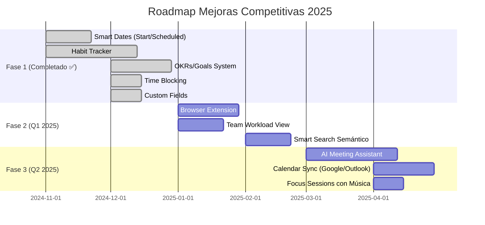

# 🎯 Mejoras Competitivas - Ordo-Todo

Esta carpeta contiene la planificación detallada para las funcionalidades que harán de Ordo-Todo **la mejor aplicación de productividad del mundo**.

## 📊 Índice de Documentos

| Prioridad | Documento | Feature | Estado |
|-----------|-----------|---------|--------|
| ⭐⭐⭐⭐⭐ | [01-HABIT-TRACKER.md](./01-HABIT-TRACKER.md) | Sistema de Hábitos | ✅ **Completado** |
| ⭐⭐⭐⭐⭐ | [02-SMART-DATES.md](./02-SMART-DATES.md) | Start Date + Scheduled Date | ✅ **Completado** |
| ⭐⭐⭐⭐ | [03-OKRS-GOALS.md](./03-OKRS-GOALS.md) | Sistema de OKRs y Metas | ✅ **Completado** |
| ⭐⭐⭐⭐ | [04-TIME-BLOCKING.md](./04-TIME-BLOCKING.md) | Time Blocking Visual | ✅ **Completado** |
| ⭐⭐⭐⭐ | [05-CUSTOM-FIELDS.md](./05-CUSTOM-FIELDS.md) | Campos Personalizados | ✅ **Completado** |
| - | [COMPETITIVE-ANALYSIS.md](./COMPETITIVE-ANALYSIS.md) | Análisis de Competencia | ✅ Completo |

## ✅ Estado de Implementación (Diciembre 2024)

### Completado (100%)
- ✅ **Habit Tracker** - Sistema completo con streaks, estadísticas y gamificación
- ✅ **Smart Dates** - Start Date, Scheduled Date y Due Date separados
- ✅ **OKRs/Goals** - Objetivos con Key Results, vinculación de tareas
- ✅ **Time Blocking** - Calendario semanal con bloques de tiempo, scheduledEndTime
- ✅ **Custom Fields** - 8 tipos de campo, editor en proyecto, integración en formularios

### Pendiente (Prioridad Media)
- 📝 **AI Meeting Assistant** - Transcripción y extracción de action items
- 📝 **Smart Search Semántico** - Búsqueda en lenguaje natural con IA
- 📝 **Browser Extension** - Quick capture desde cualquier página
- 📝 **Team Workload View** - Vista de carga del equipo
- 📝 **Focus Sessions con Música** - Sonidos ambient

### Quick Wins Pendientes
- 📝 Keyboard shortcut cheat sheet
- 📝 Batch task editing
- 📝 Quick filters presets
- 📝 Eisenhower Matrix view
- 📝 Daily/Weekly email digest
- 📝 Location-based reminders

---

## 🏗️ Principios de Integración

### 1. **Flujo Natural**
Cada feature debe sentirse como parte orgánica de la app, no como un "addon".

### 2. **Progressive Disclosure**
Funciones avanzadas ocultas hasta que el usuario las necesite.

### 3. **Consistencia de UX**
Usar los mismos patrones visuales, shortcuts y navegación existentes.

### 4. **DDD Compliance**
Cada feature sigue la arquitectura DDD con su propio dominio en `packages/core`.

### 5. **Compatibilidad Multiplataforma**
Web, Desktop y Mobile deben tener paridad de features.

---

## 🔄 Roadmap Actualizado

---

## 📈 Métricas de Éxito

Para cada feature, mediremos:

1. **Adoption Rate** - % de usuarios que usan el feature
2. **Retention Impact** - Cambio en retención a 30/60/90 días
3. **Feature NPS** - Satisfacción específica del feature
4. **Time to Value** - Tiempo hasta primer uso exitoso

---

**Última actualización:** 11 Diciembre 2024
